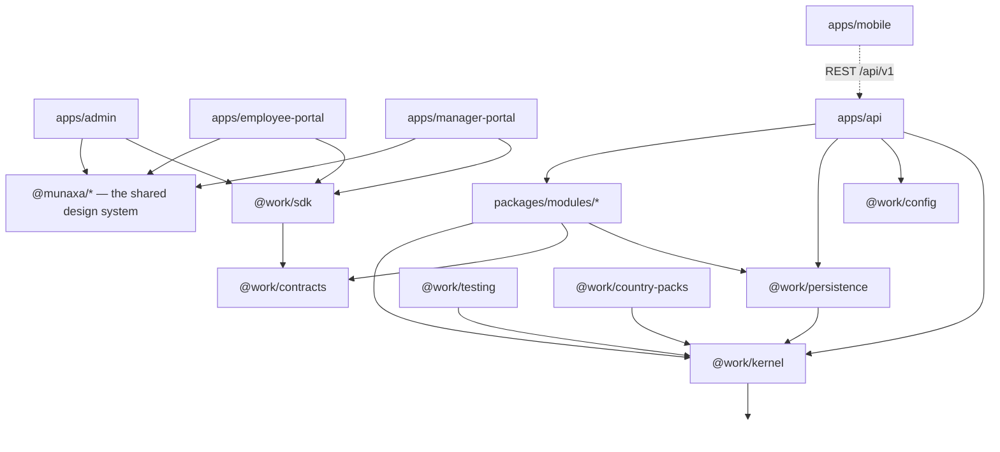

# Dependency diagram

Arrows point from a package to what it depends on. The graph is acyclic, and CI fails if it
stops being so.

## The rules this encodes

**The kernel depends on nothing.** Not on a framework, a driver, or another package of ours. If
it ever needs one, the abstraction is wrong.

**Only `@work/persistence` and a module's own `infrastructure` layer know a driver exists.**
Everything above depends on `Transaction` and `UnitOfWork`.

**Portals never reach past the SDK.** No portal imports a module, the kernel, or persistence —
the lint layer rejects it. A screen that reads a domain directly is business logic in the
presentation layer, which is the failure ADR-0013 exists to prevent.

**Modules never import each other's internals.** Only public contracts, application services and
domain events cross a module boundary.

**Nothing depends on another Munaxa product.** The `boundaries` CI job greps for it, because a
cross-product import is far cheaper to catch than to untangle.
